# DATA201/422 Group Project Report

Ryan Moore, Will Durkin, Zheyu Li

## Objective

### What makes an album successful?

To answer this objective we broke this objective down into 3 questions we could
more easily answer.

- #### What era has the most critically acclaimed albums?

- #### What makes an album critically acclaimed?

- #### What makes an album sell?

## Project Management

For ease of collaboration, we used Git and GitHub version control software. This
made it much easier to code together and communicate ideas during project development.

## Project Structure

- `brief.ipbynb` is the provided project brief.

- `diary.ipynb` is the group diary.

- `outline.ipynb` is a summary of the topics to cover in the presentation.

- `project.ipynb` is the master copy of the notebook, containing functions,
  graphs, model, etc.

- `data` directory contains the RData files.

## Data Sources

### Rate Your Music - https://rateyourmusic.com

Rate Your Music is a website that ranks albums based on a crowdsourced approach.
The ratings from users, along with the number of ratings, are aggregated to
produce a theoretically 'objective' assessment of an album's quality. We used
this dataset extensively, taking Rate Your Music as our benchmark for
determining a ‘highly rated’ album.

### Best Selling Albums - https://bestsellingalbums.org/

Best Selling Albums is a dataset that showcases historical album sales data,
breaking down the units sold by decade. We utilized this dataset to examine if
there were any common traits among the best-selling albums that could suggest
causation. For instance, we analyzed each album's 'energy' levels to determine
if there was a consistent trend in energy levels associated with highly
successful albums.

### Spotify API - https://developer.spotify.com/documentation/web-api

The Spotify API contains many endpoints which make it possible to query almost
any data you could think of from within Spotify. This includes artists, tracks,
playlists, users, albums and more. Spotify also does an internal audio analysis
of all tracks in its library, in order to recommend tracks to users.
Conveniently, this audio analysis is free and publicly available through
Spotify’s API. The audio analysis contains many values that quantify the track,
such as acousticness, danceability, loudness and energy.

From the Spotify API:

> "Energy is a measure from 0.0 to 1.0 and represents a perceptual measure of
> intensity and activity. Typically, energetic tracks feel fast, loud, and noisy.
> Perceptual features contributing to this attribute include dynamic range,
> perceived loudness, timbre, onset rate, and general entropy.”

We used energy as an attribute of an album to see whether there was any
correlation between the energy of an album and its sales, for example, or
whether there was little correlation. One hypothesis is that there is a ‘sweet
spot’ of energy wherein an album is more likely to sell well. For example,
albums with very high energy (heavy metal, noise music) are not appealing to the
masses, and neither are albums with very low energy (ambient music, etc.)

## Data Collection and Cleaning

### Rate Your Music

Rate Your Music doesn't have an API. Therefore, we had to use web scraping to
retreive the data from the website. By using the rvest package to target
specific CSS selectors, we could extract various details such as album names,
artists, ratings, release dates, genres, descriptors, number of ratings, and
number of views. This data, however, needed to be cleaned. After we collected
the data, it looked like this:

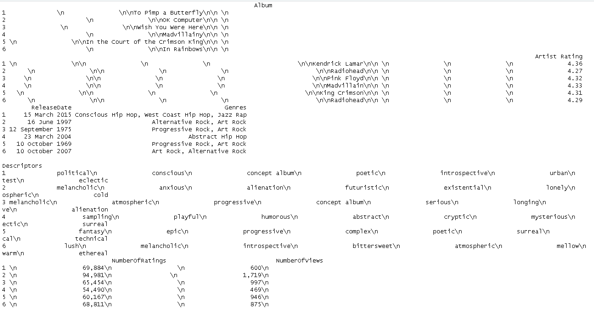

After scraping various details from the webpage, such as album names, artists,
and release dates, we undertook several data-cleaning steps. The extracted text
undergoes trimming using the `str_trim()` function to remove leading or trailing
white spaces. Ratings are filtered to avoid potential duplicates. Strings
representing ratings, the number of ratings, and views are first stripped of
commas for accuracy and then converted to a numeric format. Release dates are
formatted consistently to ensure that they are handled as date objects in
subsequent analyses. Multiple genres for a single album are fetched and merged
into a single comma-separated string for streamlined representation. Lastly,
descriptors are cleaned to replace newline characters and remove extraneous
spaces. These meticulous steps are taken to ensure that the extracted data is
accurate, consistent, and primed for further analysis. Data is cleaned as shown:

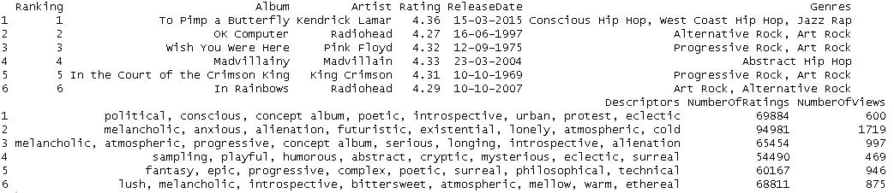

In the process of web scraping the rest of the data from RYM website, we
encountered a challenge related to data consistency. Specifically, the length of
the 'descriptors' and 'genres' columns was not aligned with the length of other
extracted attributes, like 'album_names'. To address this, we used `if`
statements to check for inconsistencies in the length of these columns. If a
mismatch was detected, we identified the indices where values might be missing.
Using the 'map2_chr' function from the 'purrr' library, we then inserted 'NA'
(Not Available) placeholders for these missing values, ensuring that the
resulting data frame maintained the proper structure and alignment. This
solution was crucial in preserving the integrity of the scraped data and
ensuring that all information was correctly represented in the final dataset.
Another issue was encountered whilst trying to scrape a large amount of pages
from the website was the rate-limiting mechanism present on on the website.
These limitations not only risked IP blocking but also substantially increased
the duration of our scraping process. To overcome this we used the `sys.sleep()`
function to introduce deliberate delays between requests in order to bypass the
rate limiting and determined an optimal delay interval that allowed us to
successfully extract all the desired data from the 125 pages.

Here is the data following the RYM scrape:

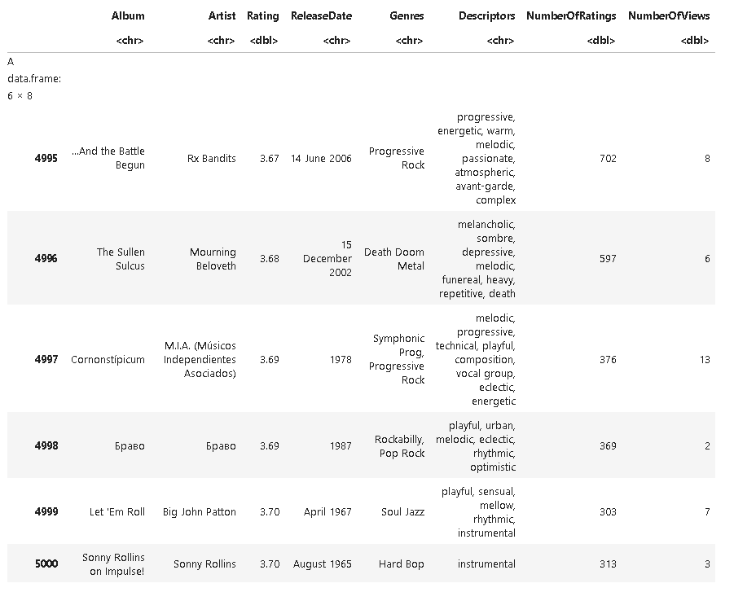

### Spotify API

To use the Spotify API, we used the spotifyr package, which conveniently
contains R function wrappers for most of the existing endpoints in the API.
However, the Spotify API does require the registration of an application on a
spotify developer account, and therefore needs a public and private key to be
passed to it to start receiving data. Once this was set up, we could retrieve an
access token and execute the spotifyr functions. However, the functions all took
internal Spotify IDs as arguments, which is not that helpful for us as we are
trying to relate data based on album, artist, and track names. Thankfully,
spotifyr also includes a `search_spotify` function. Using this function, we
could retreive the first search result of an album/artist/track by name, then
take the first result, get the ID, and pipe this into the relevant
`spotifyr::get` function in order to get all the data associated with that
object. With this knowledge, we created wrapper functions around the
`spotifyr::get` functions in order to make this process easier and more
convenient during analysis. Very little cleaning needed to be done to the
Spotify data as the `spotifyr` packages manages type conversion etc. already.
However, in the wrapper functions, we did drop some columns we didn't need for
our analysis to make life easier.

### Best Selling Albums

Best Selling Albums also did not have any public-facing API. However, the
website provided a very scraping-friendly interface, and the subpages were
organized in a logical way. There was also no rate-limiting, which made scraping
this website very convenient and easy. All the charts were stored in a <table />
element at the top of the page, which would easily converted into a dataframe
just using the html_table() function from rvest. Once this was done, all that
needed to be done was selecting the relevant columns we needed and converting
some types from character to numeric. This was the easiest data source to
retreive and clean, despite still requiring scraping.

## Wrangling and Results

### What makes an album sell?

We started our interpretation of this question by looking at whether any of the
Spotify audio features could potentially explain the popularity of an album. One
of the audio analyses that stood out to us is the 'Energy' measure. Our
hypothesis was that there is a ‘sweet spot’ of energy wherein an album is more
likely to sell well.

In order to see if there is any trend between ‘energy’ of an album and how well
it sells, we used the best-selling albums dataset to see the average energy of
tracks on the top 20 highest-selling albums in the world.

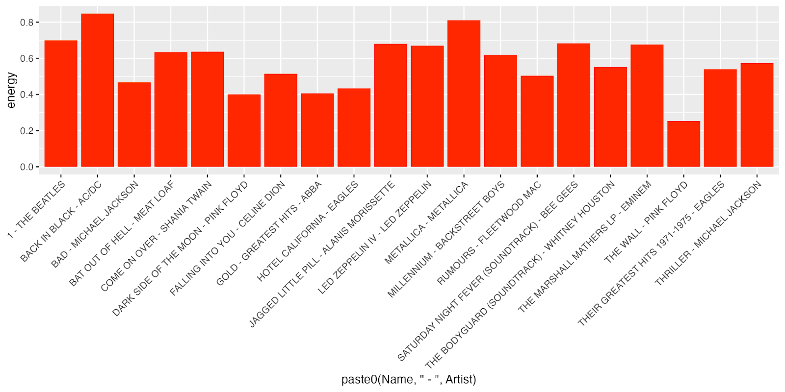

Almost all of the albums had moderate energy, between 0.4 and 0.8. Only two
albums, by AC/DC and Metallica had energy over 0.8 (due to being metal albums)
and only one album, by Pink Floyd, had energy below 0.4.

We then undertook a deeper analysis of a single artist's discography (Red Hot
Chili Peppers) to see whether we could find any more insights about the relation
between 'Energy' and an album's popularity.

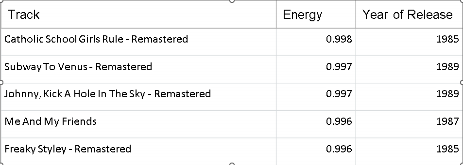

Over 75% of the RHCP’ album tracks were released **after** 1990, yet all five of
the RHCP’ top 5 most energetic tracks were released **before** 1990. This
implies that the energy of their music may have changed over time, so we
investigated this on an album basis.

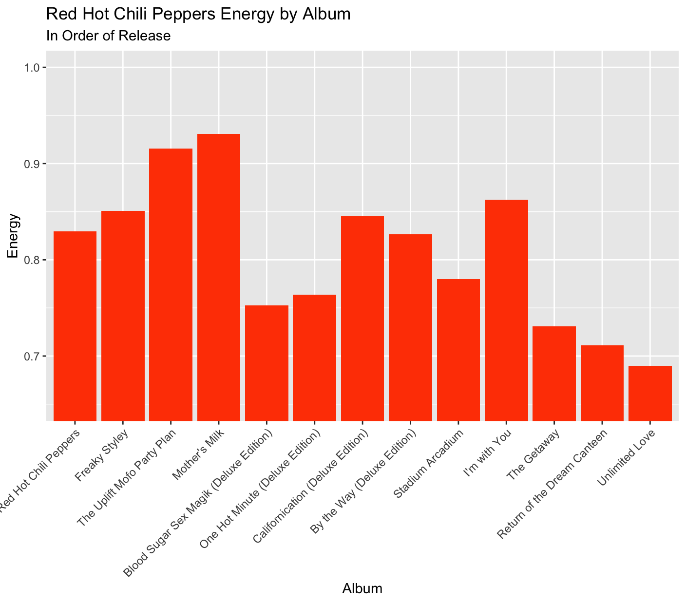

Prior to 1989’s Mother’s Milk, we can see an increasing trend in energy. During
this period, while they were still growing in popularity through the underground
scene, the RHCP were experimenting with hard funk rock at high levels of energy.
Following Mother’s Milk, we see a decreasing trend - likely due to the success
of Under The Bridge from Blood Sugar Sex Magik, a mellow and introspective song.
The decrease in energy over time signifies the RHCP’ progression towards a
mainstream audience.

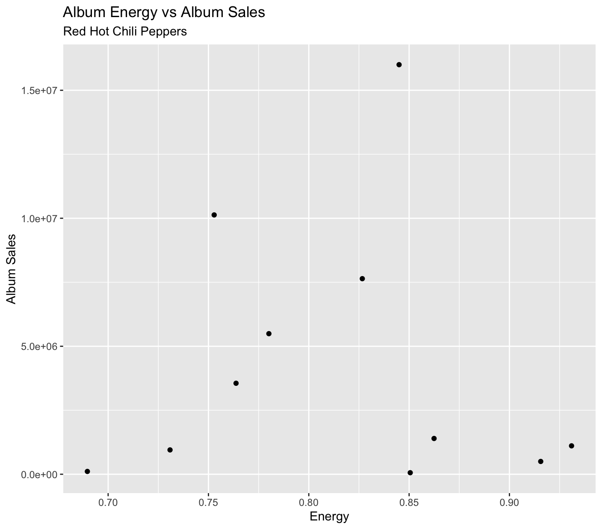

We can see a near-zero R-Squared (0.003) due to the non-linear nature of the
relationship (piece-wise function). Below energy levels of 0.85, we see a
positive relationship with a huge drop in album sales at very high energy
levels, signifying a zero relationship when energy is over 0.85. For
low-moderate levels of energy, an increase in energy is associated with an
increase in album sales. The nature of the relationship above 0.85 suggests that
there is a fine line between producing a “fun” album (higher energy, increase in
sales), without being too intense for mainstream (extreme energy, decrease in
sales).

Here, we observe a similar distribution through time to that of the band’s album
sales. Once again, an increasing trend in the funk rock era and a decreasing
trend post Under the Bridge (Blood Sugar Sex Magik). The RHCP albums have
received low audience ratings since 2006’s Stadium Arcadium.

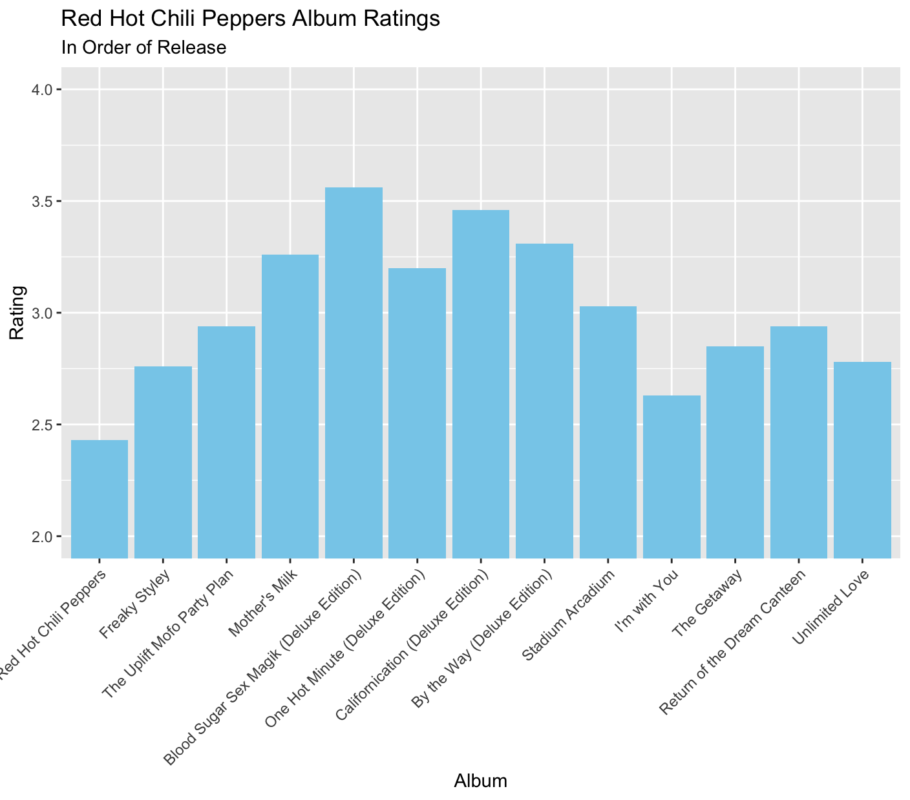

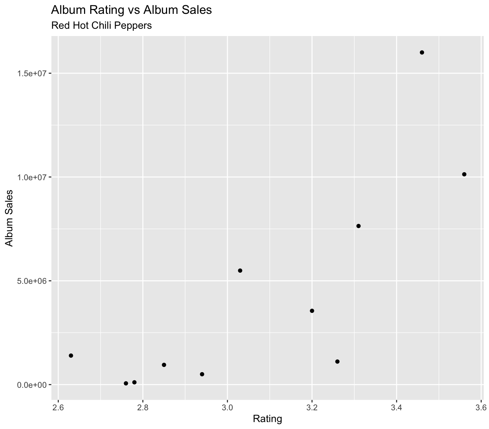

Here, we have a much higher R-Squared value of 0.63, meaning that audience
rating from RYM can explain 63% of the variation in RHCP album sales. We have a
moderate and positive relationship between album ratings and album sales. This
signifies that an increase in album ratings is associated with an increase in
album sales.

### What era has the most critically acclaimed albums?

To answer this question, we used our rateyourmusic.com dataset, and gathered the
top 5000 highest-rated albums on the whole site. We could then use the date data
from this to analyse what decade 'objectively' contains more of the best albums
based on rateyourmusic.com crowdsourcing.

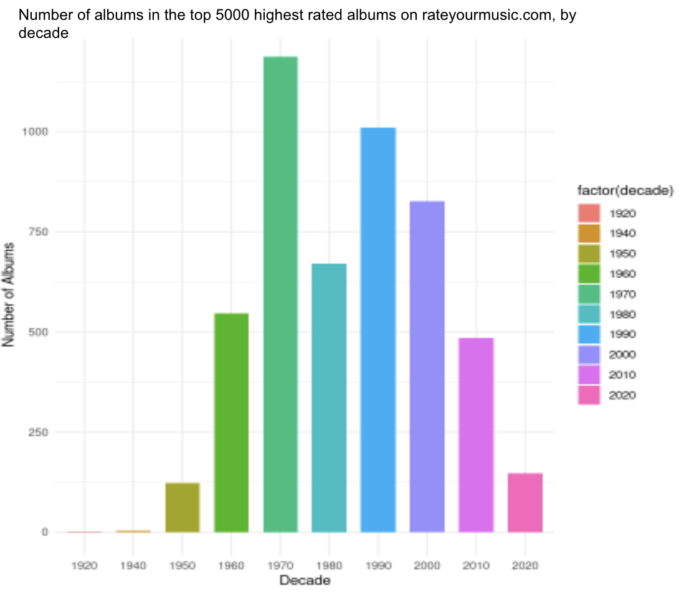

From the bar chart, it's evident that: the 1970s have the highest amount of
top-5000 rated albums, well exceeding 1000. This era is often referred to as the
"Golden Age of Rock," characterised by the flourishing of the rock genre and the
rise of influential music movements like punk, disco, and others, which might
explain the surge in high rated albums - albums that are genre-defining,
influential and creative are often more critically acclaimed.

The 2010s saw a significant drop in the amount of highly-rated albums, and the
2020s even more so, althugh data for the 2020s is incomplete as we are not even
halfway through the decade yet!

This is good but we wanted more granularity. Therefore, we also created a
histogram for ratings by year, as opposed to decade, to discover whether the
decades were overall successful, or just due to a particularly highly rated
year.

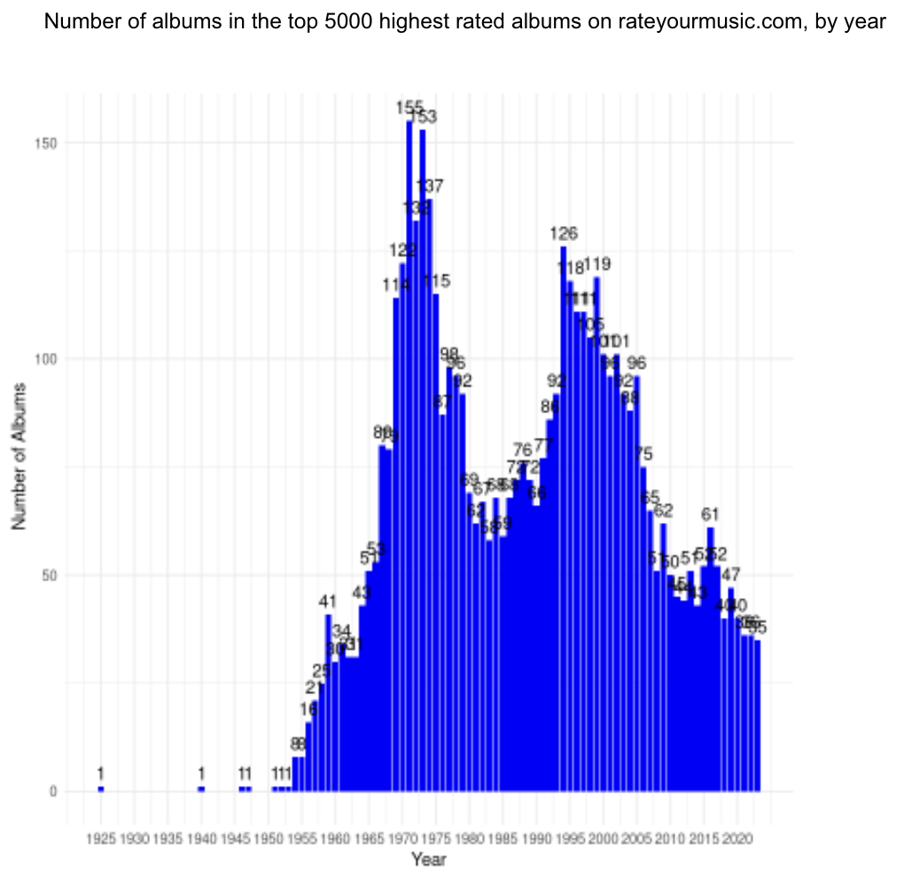

What we found is that the early 70s were constistently rating the highest, as
well as a 2nd peak in the 90's. Notably, 1971 emerges as the year with the most
high ratings, at 155 albums, suggesting a articularly vibrant period in the
music industry. What is also very apparent is that there is a high amount of
correlation between years - there is a time-oriented trend and years are not
random.

The charts offer a comprehensive overview of how highly rated music from certain
years and decades is seen. In summary, the 1970s was the most prolific era, with
subsequent high high ratings in the 1990s, 2000s, and 1980s respectively. Thus,
the prominence of the 1970s in high ratings might suggest a musically rich and
innovative period, possibly due to the cultural revolutions, technological
advancements in music recording, and the emergence of diverse genres.

### What makes an album critically acclaimed?

To answer this question, we also used the rateyourmusic.com data set. The data
set contains 5-20 descriptor words for each album on its site, separate from
genre. We can parse these descriptor words and see which descriptors show up
most commonly in the top 5000 most highly-rated albums, using text-mining
techniques in R - strucuring the data into a term-document matrix, sorted by
word frequency, and then visualising the data as a word cloud using
`RWordCloud`.

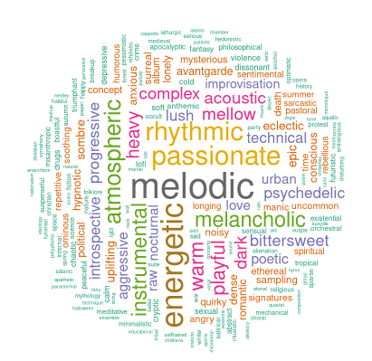

As this word cloud shows, ‘melodic’ is the most common descriptor among top 5000
albums' descriptors. High-rated albums also usually have music that is
energetic, rhythmic, passionate, melancholic, instrumental, or atmospheric.

## Conclusion

The objective of this report was to discover the characteristics which make an
album successful. Through web scraping and subsequent analysis of data from
sources such as Rate Your Music, Album Sales and the Spotify API, we found a
number of factors that contribute towards a successful album.

### What makes an album sell?

Analysing the energy levels of high-selling albums revealed that most of these
albums have tracks with moderate-high energy levels, typically falling between
0.5 and 0.85 on the Spotify 'energy' scale. Extremely high-energy tracks (e.g.,
heavy metal) and very low-energy tracks (e.g., ambient music) are less appealing
to the masses. This suggests a 'sweet spot' for energy levels in music that is
likely to sell well.

A deep dive into the music of the Red Hot Chili Peppers demonstrated the
evolution of their sound over time. Albums released before 1990 exhibited higher
energy levels, reflecting their experimentation with hard funk rock. However,
after the release of more mellow tracks like "Under the Bridge," their energy
levels decreased, aligning with their shift towards a mainstream audience.

The correlation between album ratings and sales, (investigated in the context of
Red Hot Chili Peppers' discography), revealed that album ratings from platforms
like Rate Your Music can explain a significant portion of the variation in album
sales. Higher album ratings are associated with increased sales, highlighting
the influence of critical acclaim on commercial success.

### What era has the most critically acclaimed albums?

The critical acclaim of albums varied heavily throughout the decades. Albums
from the 1970s and 1990s stood out with record-high ratings. The 1970s, often
referred to as the "Golden Age of Rock," witnessed the strongest period of
musical innovation, while the 1990s marked the rise of alternative and grunge
music, both contributing to the high ratings and critical acclaim of albums from
these times.

### What makes an album critically acclaimed?

The word cloud analysis of album descriptors highlighted that terms like
'melodic,' 'energetic,' 'passionate,' 'rhythmic,' 'melancholic,' 'instrumental,'
and 'atmospheric' are common descriptors of highly-rated albums. This indicates
that the musical characteristics and emotional depth of an album play a crucial
role in its critical acclaim.

### In Summary: What makes an album succesful?

We can conclude that a successful album can be achieved through the fusion of
receiving high critical acclaim, being released in an era marked by musical
experimentation, containing specific musical attributes such as melodic and
passionate tracks, and boasting a high but balanced level of energy. While there
is no definitive formula for success in the music industry, understanding these
key factors can significantly improve an album's chances of achieving critical
acclaim and commercial prosperity. Artists and music industry professionals can
use this knowledge to guide their creative and marketing efforts and create
albums that stand the test of time.

Although we have achieved a great depth of analysis and made some interesting
conclusions, we cannot confidently say we succeeded in generalising our results
for the music industry. We selected a handful of convenient (potentially biased)
websites to scrape data from and used the results of a case study developed
around one band to make comments about the music industry as a whole.

Additionally, we looked at very few predictor variables (e.g. only using
'Energy' value from Spotify to define the success of an album) when in fact the
success of an album is due to many, many different predictors, and cannot be
explained with a simple relationship. No doubt luck also plays a large part in
an album's success.

We are also likely to have conflated correlation and causation in several parts
of our analysis. If we were to continue this research, we would investigate the
websites’ reputability and use data from many different sources. We would also
take random samples of industry data before making generalisations, as opposed
to selecting one band and assuming the results of that band will apply
industry-wide. Although professionals can use this report to guide their
efforts, it must be used with caution and in conjunction with their own research
from reputable sources.
